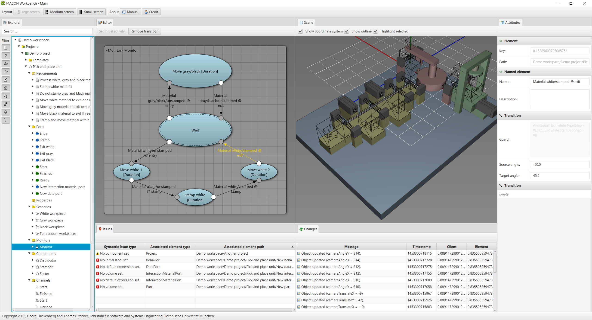

# Spatio-Temporal IDE

**Integrated Development Environment (IDE) for Spatio-Temporal Systems.**

The tool includes the following features:

* Component-based systems modeling
* Mechanical, electrical, and software interface modeling
* Logic-based constraint and quality modeling
* State machine based monitor, test case, and behavior modeling

Here is a screenshot of the application:

